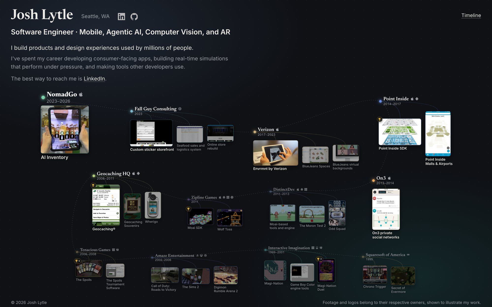

# Josh Lytle
**Software Engineer · Mobile, Agentic AI, Computer Vision, and AR**

The contribution graph below is real work in private repositories: over 16,000 contributions since 2023, spanning years of iOS and computer vision work, and most recently agentic AI workflows built with Claude Code.

Because that work isn't public, I built an interactive career map of the products I shipped and my part in each.

👉 **[Explore my portfolio at joshlytle.dev](https://joshlytle.dev)**

📫 **The best way to reach me is [LinkedIn](https://www.linkedin.com/in/joshlytle1).**
